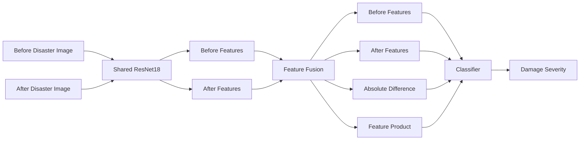

# DisasterDiff

## Explainable Building Damage Assessment Using Pre- and Post-Disaster Satellite Imagery

**DisasterDiff** is a deep learning system for assessing building damage severity by comparing satellite imagery captured **before and after a disaster**.

The project uses transfer learning with a **Siamese ResNet18 architecture with shared weights** to learn temporal changes between paired building images.

---

## Live Demo

🌐 **Web Application:**  
https://disasterdiff-production.up.railway.app/

📚 **Interactive API Documentation:**  
https://disasterdiff-production.up.railway.app/docs

❤️ **Health Check:**  
https://disasterdiff-production.up.railway.app/health

---

## Damage Classes

The model predicts one of four damage levels:

- No Damage
- Minor Damage
- Major Damage
- Destroyed

---

## Dataset

The project uses the **xBD / xView2 disaster damage dataset**, containing pre- and post-disaster satellite imagery from multiple disaster events.

After preprocessing:

- **158,213** valid building image pairs were extracted
- **10** disaster events were represented
- Images were cropped around individual buildings
- Pre- and post-disaster images use the same spatial crop

### Class Distribution

| Damage Class | Samples |
|---|---:|
| No Damage | 116,242 |
| Minor Damage | 14,905 |
| Major Damage | 14,086 |
| Destroyed | 12,980 |

The dataset is strongly class-imbalanced, so class-weighted loss and Macro F1 evaluation were used.

---

## Leakage-Safe Data Splitting

To avoid data leakage, train, validation, and test splits were created at the **source-tile level** rather than randomly splitting individual building crops.

| Split | Samples |
|---|---:|
| Train | 106,637 |
| Validation | 25,598 |
| Test | 25,978 |

No source tile appears in more than one split.

---

## Data Preprocessing

The preprocessing pipeline includes:

- Parsing xBD JSON annotations
- Filtering unclassified buildings
- Extracting matched pre/post building crops
- Square crop generation with contextual padding
- Minimum crop-size enforcement
- Resize to `224 × 224`
- ImageNet normalization
- Random horizontal flips
- Random vertical flips
- Small random rotations

For paired training, the **same spatial augmentation is applied to both images**.

---

## Models

### Baseline — Post-only ResNet18

The baseline model uses a pretrained ResNet18 and only the **post-disaster image**.

This establishes whether paired temporal information actually improves performance.

### Proposed Model — Siamese ResNet18

The final model processes both the pre- and post-disaster images using a **shared ResNet18 backbone**.

The extracted features are combined using:

- Before-image features
- After-image features
- Absolute feature difference
- Element-wise feature interaction

The fused representation is passed through a classification head to predict the four damage classes.

---

## Model Architecture



---

## Training Strategy

Training was performed in two stages.

### Stage 1 — Classifier Training

- Pretrained ResNet18 backbone frozen
- Classification head trained
- Weighted cross-entropy loss used

### Stage 2 — Fine-Tuning

- Final ResNet block (`layer4`) unfrozen
- Smaller learning rate used for the backbone
- Higher learning rate retained for the classifier
- AdamW optimizer
- Learning-rate scheduling
- Early stopping based on validation Macro F1

A final low-learning-rate fine-tuning phase improved the validation Macro F1 to:

**0.7187**

---

## Handling Class Imbalance

The training set is dominated by the no-damage class.

Weighted cross-entropy was therefore used with approximately:

| Class | Weight |
|---|---:|
| No Damage | 0.3500 |
| Minor Damage | 2.5676 |
| Major Damage | 2.7901 |
| Destroyed | 2.5317 |

This encourages the model to pay more attention to minority damage classes.

---

## Model Results

| Model | Test Accuracy | Macro Precision | Macro Recall | Macro F1 |
|---|---:|---:|---:|---:|
| Post-only ResNet18 | **80.94%** | 62.14% | 75.78% | 66.76% |
| Siamese ResNet18 | 78.49% | **65.84%** | **75.84%** | **67.77%** |

Although the post-only ResNet18 achieves higher overall accuracy, the Siamese model achieves the **best Macro F1 and Macro Precision**.

Because the dataset is highly class-imbalanced, **Macro F1 was selected as the primary evaluation metric**, as it gives equal importance to all four classes.

---

## Final Siamese Test Performance

- **Test Accuracy:** 78.49%
- **Macro Precision:** 65.84%
- **Macro Recall:** 75.84%
- **Macro F1:** 67.77%

### Per-Class Performance

| Damage Class | Precision | Recall | F1 Score |
|---|---:|---:|---:|
| No Damage | 98.12% | 79.79% | 88.01% |
| Minor Damage | 33.00% | 81.41% | 46.96% |
| Major Damage | 69.07% | 62.59% | 65.67% |
| Destroyed | 63.16% | 79.58% | 70.42% |

The model performs particularly well on **no-damage** and **destroyed** buildings.

Minor damage remains the most challenging class: the model achieves high recall but comparatively low precision, indicating that some samples from neighboring damage levels are predicted as minor damage.

---

## Evaluation Metrics

### Primary Metric

- Macro F1 Score

### Additional Metrics

- Accuracy
- Macro Precision
- Macro Recall
- Per-class Precision
- Per-class Recall
- Per-class F1
- Confusion Matrix
- Normalized Confusion Matrix

---

## Explainability with Grad-CAM

Grad-CAM is used on the final convolutional block of the shared ResNet18 backbone to visualize which spatial regions contribute to the model's decision.

Because the architecture processes paired imagery, Grad-CAM can be generated for both:

- Pre-disaster image
- Post-disaster image

This helps inspect whether the network is focusing on meaningful building regions and disaster-induced visual changes.

If the Grad-CAM images are present in `reports/figures/`, add:

```markdown
### Major Damage Example


### Destroyed Example


```

---

## FastAPI Backend

The trained model is integrated into a **FastAPI REST API**.

### Endpoints

| Method | Endpoint | Description |
|---|---|---|
| GET | `/` | Web application |
| GET | `/health` | Model/API health check |
| GET | `/docs` | Interactive Swagger documentation |
| POST | `/predict` | Damage prediction |

The `/predict` endpoint accepts:

- `before_image`
- `after_image`

and returns:

- Predicted damage class
- Confidence score
- Probability for every damage class

Example response:

```json
{
    "prediction": "destroyed",
    "confidence": 0.927,
    "probabilities": {
        "no-damage": 0.001,
        "minor-damage": 0.003,
        "major-damage": 0.070,
        "destroyed": 0.927
    }
}
```

---

## Web Application

The frontend allows users to:

1. Upload a pre-disaster image
2. Upload the corresponding post-disaster image
3. Run damage analysis
4. View the predicted damage class
5. View confidence and class probabilities

The frontend communicates directly with the FastAPI backend.

---

## Deployment

The complete application is containerized using **Docker** and deployed on **Railway**.

Deployment includes:

- FastAPI backend
- Siamese ResNet18 checkpoint
- Static frontend
- CPU-based PyTorch inference
- Public HTTPS endpoint

Live application:

https://disasterdiff-production.up.railway.app/

---

## Project Structure

```text
DisasterDiff/
│
├── app/
│   ├── __init__.py
│   ├── main.py
│   ├── model.py
│   ├── preprocessing.py
│   └── schemas.py
│
├── frontend/
│   ├── index.html
│   ├── styles.css
│   └── app.js
│
├── models/
│   └── best_siamese_resnet18.pth
│
├── notebooks/
│   └── 01_data_exploration.ipynb
│
├── reports/
│   └── figures/
│
├── src/
│   ├── data/
│   ├── models/
│   └── training/
│
├── Dockerfile
├── requirements.txt
├── requirements-deploy.txt
├── .dockerignore
├── .gitignore
└── README.md
```

---

## Tech Stack

### Deep Learning

- PyTorch
- Torchvision
- ResNet18
- Transfer Learning
- Siamese Neural Networks
- Grad-CAM

### Data & Evaluation

- Pandas
- NumPy
- Scikit-learn
- Matplotlib
- Pillow

### Backend

- FastAPI
- Uvicorn

### Frontend

- HTML
- CSS
- JavaScript

### Deployment

- Docker
- Railway
- GitHub

---

## Key Project Takeaways

- Temporal comparison between pre- and post-disaster imagery can improve balanced classification performance.
- Overall accuracy alone can be misleading for strongly imbalanced datasets.
- Group-based splitting is important for avoiding spatial leakage in satellite imagery.
- Weighted loss significantly improves sensitivity to minority damage classes.
- Grad-CAM provides a useful mechanism for inspecting spatial attention.
- The complete deep learning model can be served through a production-style REST API and web application.

---

## Disclaimer

DisasterDiff is a research prototype designed for educational and experimental purposes.

Its predictions should **not** be used as a substitute for official disaster assessment or on-site structural inspection.