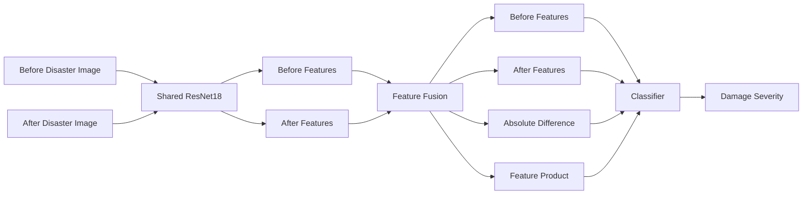
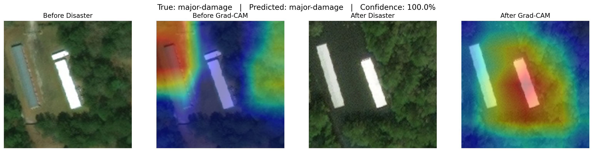
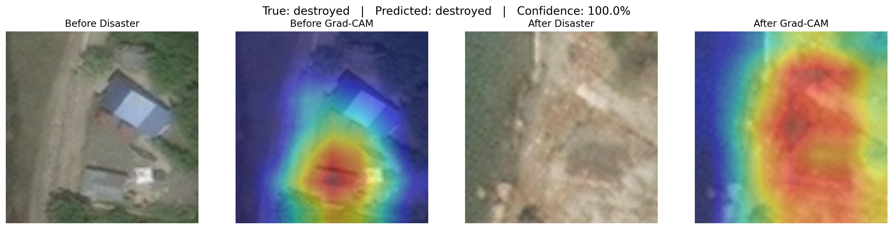

# 🛰️ DisasterDiff

## Explainable Building Damage Assessment Using Pre- and Post-Disaster Satellite Imagery

**DisasterDiff** is an end-to-end deep learning system that predicts building damage severity by comparing satellite imagery captured **before and after a disaster**.

The project uses **transfer learning**, a **Siamese ResNet18 with shared weights**, class-imbalance handling, Grad-CAM explainability, a FastAPI inference backend, a web interface, Docker, and Railway deployment.

---

## 🌐 Live Demo

**Web Application:**  
https://disasterdiff-production.up.railway.app/

**Interactive API Documentation:**  
https://disasterdiff-production.up.railway.app/docs

**Health Check:**  
https://disasterdiff-production.up.railway.app/health

---

## 🎯 Problem Statement

After natural disasters, rapidly estimating building-level damage can help prioritize rescue, inspection, and recovery efforts.

A post-disaster image alone may not always reveal what changed.

DisasterDiff therefore compares:

- a **pre-disaster image**
- a **post-disaster image**

of the same building and predicts one of four damage levels.

### Damage Classes

1. No Damage
2. Minor Damage
3. Major Damage
4. Destroyed

---

# 📊 Dataset

The project uses the **xBD / xView2 Building Damage Assessment dataset** containing pre- and post-disaster satellite imagery from multiple disaster events.

After preprocessing:

- **158,213 valid building pairs**
- **10 disaster events**
- **2,240 source tiles**
- matched pre/post spatial crops
- individual building-level samples

### Class Distribution

| Damage Class | Samples |
|---|---:|
| No Damage | 116,242 |
| Minor Damage | 14,905 |
| Major Damage | 14,086 |
| Destroyed | 12,980 |

The dataset is strongly imbalanced, with the majority of buildings belonging to the **No Damage** class.

---

# 🔒 Leakage-Safe Data Splitting

Randomly splitting individual building crops can cause spatial leakage because multiple buildings may come from the same satellite tile.

To prevent this, splitting was performed using the **source tile ID as the grouping variable**.

| Split | Samples | Source Tiles |
|---|---:|---:|
| Train | 106,637 | 1,568 |
| Validation | 25,598 | 336 |
| Test | 25,978 | 336 |

There is **no source-tile overlap** between train, validation, and test sets.

---

# 🧹 Data Preprocessing

The preprocessing pipeline includes:

- parsing xBD JSON annotations
- extracting building polygons
- removing unclassified buildings
- filtering extremely small buildings
- generating square crops around each building
- adding surrounding contextual padding
- using the same crop for pre- and post-disaster imagery
- resizing images to `224 × 224`
- ImageNet normalization
- random horizontal flips
- random vertical flips
- small random rotations

For Siamese training, the **same geometric augmentation is applied to both images** so their spatial correspondence is preserved.

---

# 🧠 Models

## 1. Baseline — Post-only ResNet18

The baseline uses a pretrained **ResNet18** and only the post-disaster image.

This answers an important question:

> Does comparing pre- and post-disaster imagery provide useful information beyond using the post-disaster image alone?

---

## 2. Proposed Model — Siamese ResNet18

The final architecture uses a **shared ResNet18 backbone** for both images.

The same encoder processes:

- the before image
- the after image

producing two comparable feature vectors.

The classifier then combines:

- before-image features
- after-image features
- absolute feature difference
- element-wise feature product

Conceptually:

```text
Before Image ──► Shared ResNet18 ──► Before Features ─┐
                                                     │
After Image  ──► Shared ResNet18 ──► After Features ─┤
                                                     │
                         |Before - After| ────────────┤
                                                     │
                         Before × After ──────────────┤
                                                     ▼
                                               Classifier
                                                     │
                                                     ▼
                                         Damage Severity
```

---

# 🏗️ Model Architecture



---

# ⚙️ Training Strategy

Training was performed in multiple transfer-learning stages.

## Stage 1 — Train the Classification Head

- pretrained ResNet18 backbone frozen
- classifier trained
- weighted cross-entropy loss
- AdamW optimizer

## Stage 2 — Fine-Tune High-Level Features

- `layer4` of ResNet18 unfrozen
- smaller learning rate for backbone
- larger learning rate for classifier
- learning-rate reduction on plateau
- early stopping based on validation Macro F1

## Low-Learning-Rate Fine-Tuning

A final short fine-tuning phase using reduced learning rates improved validation performance.

### Best Validation Macro F1

**0.7187**

---

# ⚖️ Handling Class Imbalance

Because most samples belong to the No Damage class, ordinary cross-entropy could encourage the model to over-predict the majority class.

Weighted cross-entropy was therefore used.

Approximate training weights:

| Class | Weight |
|---|---:|
| No Damage | 0.3500 |
| Minor Damage | 2.5676 |
| Major Damage | 2.7901 |
| Destroyed | 2.5317 |

This gives minority damage classes greater influence during training.

---

# 📈 Model Results

## Baseline vs Siamese

| Model | Test Accuracy | Macro Precision | Macro Recall | Macro F1 |
|---|---:|---:|---:|---:|
| Post-only ResNet18 | **80.94%** | 62.14% | 75.78% | 66.76% |
| Siamese ResNet18 | 78.49% | **65.84%** | **75.84%** | **67.77%** |

The post-only model achieves higher overall accuracy.

However, the Siamese model obtains:

- higher **Macro Precision**
- higher **Macro Recall**
- higher **Macro F1**

Because the dataset is highly imbalanced, **Macro F1 was selected as the primary evaluation metric**.

Macro F1 gives equal importance to all damage classes instead of allowing the dominant No Damage class to dominate the score.

---

# 📋 Final Siamese Test Performance

- **Test Accuracy:** 78.49%
- **Macro Precision:** 65.84%
- **Macro Recall:** 75.84%
- **Macro F1:** 67.77%

### Per-Class Performance

| Damage Class | Precision | Recall | F1 Score |
|---|---:|---:|---:|
| No Damage | 98.12% | 79.79% | 88.01% |
| Minor Damage | 33.00% | 81.41% | 46.96% |
| Major Damage | 69.07% | 62.59% | 65.67% |
| Destroyed | 63.16% | 79.58% | 70.42% |

### Observation

The most difficult class is **Minor Damage**.

It achieves high recall but comparatively low precision, indicating confusion between visually neighboring levels of damage severity.

This is expected because the boundaries between minor and major structural damage can be subtle in satellite imagery.

---

# 🔍 Explainability with Grad-CAM

Grad-CAM was applied to the final convolutional block of the shared ResNet18 backbone.

Because the model processes both pre- and post-disaster images, separate activation maps can be produced for each branch.

This helps inspect whether the model is attending to relevant buildings and disaster-induced changes.

## Major Damage Example

[](reports/figures/gradcam_major-damage.png)

## Destroyed Example

[](reports/figures/gradcam_destroyed.png)

In the destroyed example, strong post-disaster attention is concentrated around the region where the original structure has disappeared.

---

# 🌐 Web Application

The frontend provides a simple interface where users can:

1. upload a pre-disaster satellite crop
2. upload the corresponding post-disaster crop
3. run damage analysis
4. view the predicted damage class
5. view model confidence
6. inspect probabilities for all four classes

The frontend communicates directly with the FastAPI backend.

---

# ⚡ FastAPI Backend

The trained Siamese model is served using **FastAPI**.

## Endpoints

| Method | Endpoint | Description |
|---|---|---|
| GET | `/` | DisasterDiff web application |
| GET | `/ui` | Frontend |
| GET | `/health` | API/model health check |
| GET | `/docs` | Swagger API documentation |
| POST | `/predict` | Predict building damage |

---

## Prediction Request

`POST /predict`

The endpoint accepts:

```text
before_image
after_image
```

as multipart image files.

### Example Response

```json
{
  "prediction": "destroyed",
  "confidence": 0.927,
  "probabilities": {
    "no-damage": 0.001,
    "minor-damage": 0.003,
    "major-damage": 0.070,
    "destroyed": 0.927
  }
}
```

---

# 🐳 Deployment

The complete application is containerized using **Docker** and deployed on **Railway**.

The production container includes:

- FastAPI backend
- static frontend
- final Siamese ResNet18 checkpoint
- CPU-only PyTorch inference
- Uvicorn server

### Production Application

https://disasterdiff-production.up.railway.app/

---

# 📁 Project Structure

```text
DisasterDiff/
│
├── app/
│   ├── __init__.py
│   ├── main.py
│   ├── model.py
│   ├── preprocessing.py
│   └── schemas.py
│
├── frontend/
│   ├── index.html
│   ├── styles.css
│   └── app.js
│
├── models/
│   └── best_siamese_resnet18.pth
│
├── notebooks/
│   └── 01_data_exploration.ipynb
│
├── reports/
│   └── figures/
│
├── src/
│   ├── data/
│   ├── models/
│   │   ├── baseline.py
│   │   └── test_baseline.py
│   │
│   └── training/
│       └── compute_class_weights.py
│
├── Dockerfile
├── requirements.txt
├── requirements-deploy.txt
├── .dockerignore
├── .gitignore
└── README.md
```

---

# 💻 Local Setup

## 1. Clone the repository

```bash
git clone https://github.com/KhushiAgarwal0406/DisasterDiff.git
cd DisasterDiff
```

## 2. Create a virtual environment

```bash
python -m venv venv
```

### Windows

```bash
venv\Scripts\activate
```

### Linux / macOS

```bash
source venv/bin/activate
```

## 3. Install dependencies

```bash
pip install -r requirements.txt
```

## 4. Start FastAPI

```bash
uvicorn app.main:app --reload
```

Open:

```text
http://127.0.0.1:8000
```

Swagger documentation:

```text
http://127.0.0.1:8000/docs
```

---

# 🛠️ Tech Stack

## Deep Learning

- PyTorch
- Torchvision
- ResNet18
- Transfer Learning
- Siamese Neural Networks
- Grad-CAM

## Data Processing & Evaluation

- Pandas
- NumPy
- Scikit-learn
- Pillow
- Matplotlib

## Backend

- FastAPI
- Uvicorn
- Pydantic

## Frontend

- HTML
- CSS
- JavaScript

## Deployment

- Docker
- Railway
- GitHub

---

# 💡 Key Learnings

This project demonstrates several practical machine learning lessons:

- paired temporal imagery can provide useful information beyond post-disaster imagery alone
- overall accuracy is not always appropriate for imbalanced classification
- Macro F1 provides a better view of performance across damage classes
- spatial/group leakage must be considered when splitting satellite datasets
- class-weighted loss improves minority-class sensitivity
- transfer learning enables effective training with pretrained CNN backbones
- Grad-CAM helps inspect what image regions influence predictions
- trained deep learning models can be integrated into production-style REST APIs
- Docker provides reproducible inference environments
- Railway allows the complete ML application to be publicly deployed

---

# ⚠️ Limitations

- Minor and Major Damage can be visually difficult to distinguish.
- Satellite image quality differs between disaster events.
- Class imbalance remains significant.
- Predictions depend on matched crops of the same building.
- The system performs classification on already-cropped buildings rather than detecting buildings from full satellite scenes.
- Confidence scores should not be interpreted as structural engineering certainty.

---

# 🚀 Possible Future Improvements

Future versions could explore:

- stronger backbones such as EfficientNet or ConvNeXt
- vision transformers
- focal loss
- disaster-aware domain adaptation
- better probability calibration
- automatic building localization
- segmentation-based damage assessment
- larger hyperparameter searches
- uncertainty estimation
- interactive Grad-CAM visualization in the frontend

---

# ⚠️ Disclaimer

DisasterDiff is a research and educational prototype.

Predictions should **not** be used as a substitute for official disaster assessment, engineering inspection, or emergency-response decisions.